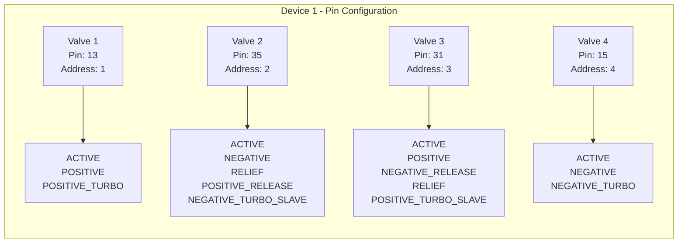
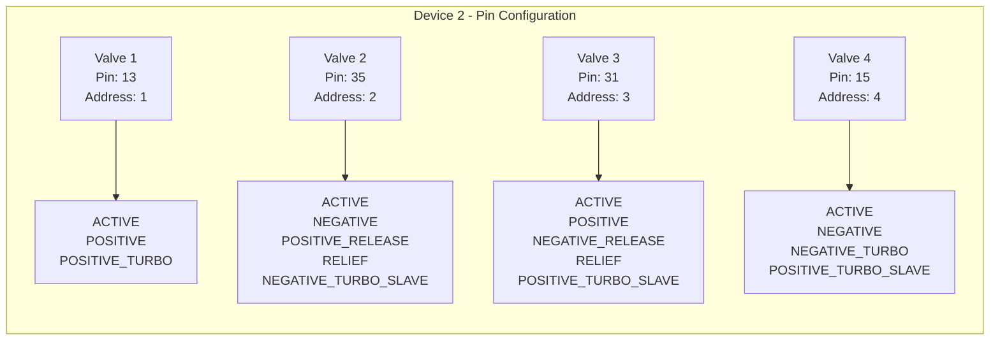

# Pin Configuration

## Device 1 (config1.json)

## Device 2 (config2.json)

## Pin Mapping Summary

| Valve | Device 1 Pin | Device 2 Pin | Difference |
|-------|--------------|--------------|------------|
| Valve 1 | 13 | 13 | Same |
| Valve 2 | 35 | 35 | Same |
| Valve 3 | 31 | 31 | Same |
| Valve 4 | 15 | 15 | Same |

## Role Differences

**Valve 4**: Device 2 has additional role `POSITIVE_TURBO_SLAVE` that Device 1 does not have.
