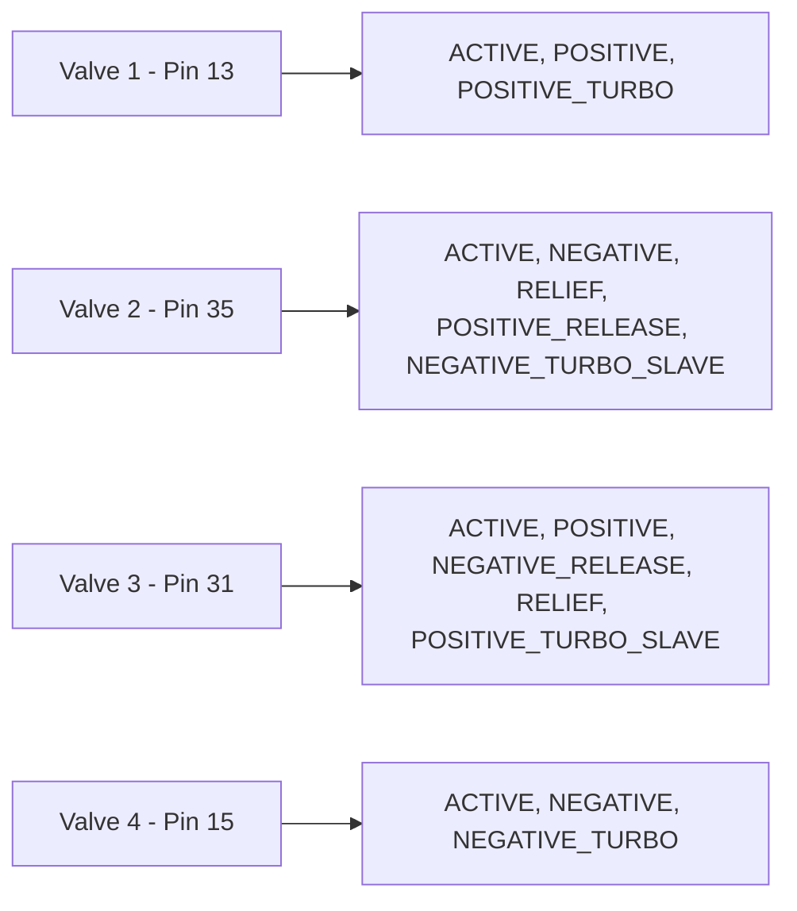
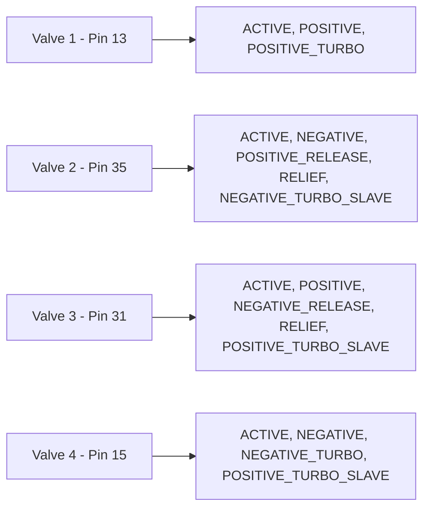

# Configuration Documentation

> **Looking for the LabOS ↔ Airtable integration docs, or the current project status?**
> Start at **[`INDEX.md`](INDEX.md)** — it maps every document in both repos and on Notion, and says
> which one is authoritative for which subject. This file covers **hardware configuration only**.

## Modbus RTU Configuration

| Parameter | Device 1 | Device 2 | Notes |
|-----------|----------|----------|-------|
| Port | `/dev/ttyACM0` | `/dev/ttyACM0` | Same |
| Baudrate | 9600 | 9600 | Same |
| Byte Size | 8 | 8 | Same |
| Parity | PARITY_NONE | PARITY_NONE | Same |
| Stop Bits | 1 | 1 | Same |
| Mode | MODE_RTU | MODE_RTU | Same |
| Clear Buffers Before Each Transaction | true | true | Same |
| Close Port After Each Call | true | true | Same |

## Delta C2000 Plus VFD Configuration

> **Modbus address is per-device — verify it, don't assume.** The examples below use `12`, which is what the
> production VFDs answer on (found during the 2026-07-07 system-1 bring-up; a stale `5` in config is why the
> VFD went silent). `tools/scanner.py` probes the bus if you need to find it again.

The serial service can control the VFD over either Modbus RTU or Modbus TCP.
The MQTT command topics stay the same; only the `vfd` config block chooses the
transport.

### Serial RS-485 example

```json
{
  "serial": {
    "port": "/dev/ttyACM0",
    "baudrate": 9600,
    "bytesize": 8,
    "parity": "PARITY_NONE",
    "stopbits": 1,
    "timeout": 0.05,
    "mode": "MODE_RTU",
    "clear_buffers_before_each_transaction": true,
    "close_port_after_each_call": true
  },
  "vfd": {
    "name": "vfd1",
    "address": "12",
    "transport": "serial",
    "dry_run": false,
    "timeout": 2.0,
    "frequency": 20,
    "tcp": {
      "host": "",
      "port": 502
    }
  }
}
```

For RS-485 control, configure the Delta C2000 Plus parameters:

- `00-20 = 1` for frequency command from RS-485
- `00-21 = 2` for operation command from RS-485

### TCP/IP example

```json
{
  "vfd": {
    "name": "vfd1",
    "address": "12",
    "transport": "tcp",
    "dry_run": false,
    "timeout": 2.0,
    "tcp": {
      "host": "192.0.2.10",
      "port": 502
    }
  }
}
```

For Ethernet card control, configure the Delta C2000 Plus parameters:

- `00-20 = 8` for frequency command from communication card
- `00-21 = 5` for operation command from communication card
- `09-75 = 0` for static IP or `09-75 = 1` for DHCP
- `09-76..09-79` for IP address octets
- `09-80..09-83` for subnet mask octets
- `09-84..09-87` for gateway octets

Software control is not a safety system. Use a physical emergency stop and
proper VFD wiring, protection, and commissioning procedures.

<div style="page-break-after: always;"></div>

## Pin Configuration

### Device 1 (config1.json)



### Device 2 (config2.json)



## Pin Mapping Summary

| Valve | Device 1 Pin | Device 2 Pin | Difference |
|-------|--------------|--------------|------------|
| Valve 1 | 13 | 13 | Same |
| Valve 2 | 35 | 35 | Same |
| Valve 3 | 31 | 31 | Same |
| Valve 4 | 15 | 15 | Same |

## Role Differences

**Valve 4**: Device 2 has additional role `POSITIVE_TURBO_SLAVE` that Device 1 does not have.
