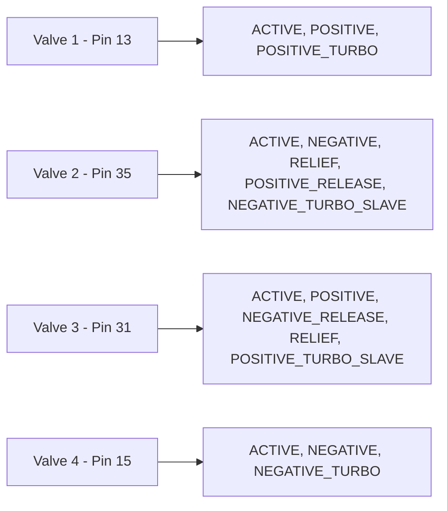
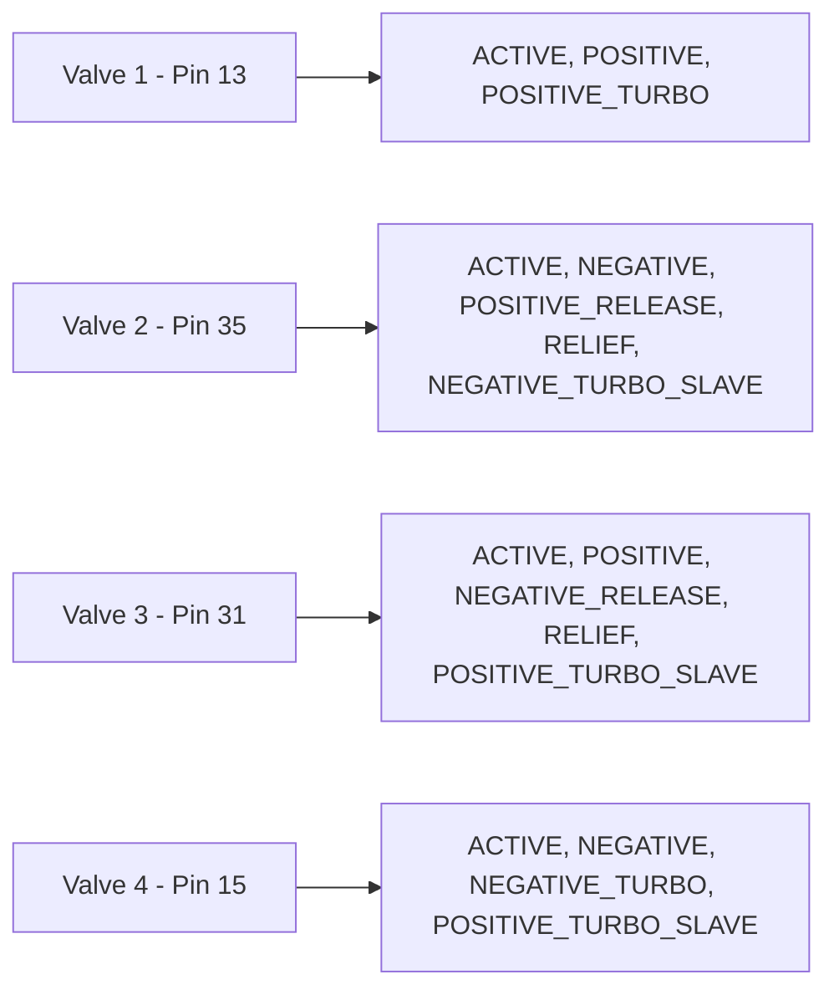

# Configuration Documentation

## Modbus RTU Configuration

| Parameter | Device 1 | Device 2 | Notes |
|-----------|----------|----------|-------|
| Port | `/dev/ttyACM0` | `/dev/ttyACM0` | Same |
| Baudrate | 9600 | 9600 | Same |
| Byte Size | 8 | 8 | Same |
| Parity | PARITY_NONE | PARITY_NONE | Same |
| Stop Bits | 1 | 1 | Same |
| Mode | MODE_RTU | MODE_RTU | Same |
| Clear Buffers Before Each Transaction | true | true | Same |
| Close Port After Each Call | true | true | Same |

## Pin Configuration

### Device 1 (config1.json)

### Device 2 (config2.json)

## Pin Mapping Summary

| Valve | Device 1 Pin | Device 2 Pin | Difference |
|-------|--------------|--------------|------------|
| Valve 1 | 13 | 13 | Same |
| Valve 2 | 35 | 35 | Same |
| Valve 3 | 31 | 31 | Same |
| Valve 4 | 15 | 15 | Same |

## Role Differences

**Valve 4**: Device 2 has additional role `POSITIVE_TURBO_SLAVE` that Device 1 does not have.
